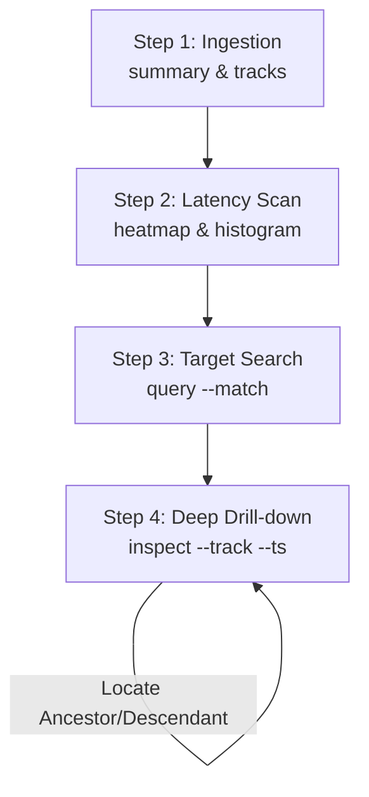

# Trace Analyzer Skill

This skill equips AI agents to systematically ingest, query, and diagnose Chrome Trace files (and Bazel execution profiles) using the native, high-performance `ztracing` CLI tool, assuming the `ztracing` binary is already available in the system execution path.

---

## 1. The Tool Suite Reference

The CLI utility provides six subcommands, all supporting an optional global `--pretty` flag for formatted JSON output.

### A. `summary <trace_file> [--pretty]`
Exposes high-level metadata of the trace (total events, concurrent tracks, and physical duration bounds).
*   **Use Case**: Initial trace ingestion. Use this to assess the total scale of the profile.

### B. `tracks <trace_file> [--pretty]`
Lists all organized tracks showing their names, types (THREAD/COUNTER), event counts, and maximum stack depths.
*   **Use Case**: Thread concurrency mapping. Use this to identify active threads and trace-naming schemas.

### C. `inspect <trace_file> --track <name> --ts <ts_us> [--pretty]`
Performs a state-free coordinate lookup of a specific event, returning its inclusive duration, pre-calculated exclusive self-time, depth, parent coordinate, nested children coordinates, and custom arguments.
*   **Use Case**: Deep bottleneck analysis. Call this to inspect a specific event's parameters and call-tree context.

### D. `query <trace_file> [filters] [--pretty]`
Performs a chronological search and viewport extraction.
*   **Filters**:
    *   `--track <name>`: Scans only the target track.
    *   `--match <substr>`: Substring match on name/category (case-insensitive).
    *   `--t-start <us>` / `--t-end <us>`: Time-window interval overlap filtering.
    *   `--max-depth <n>`: Excludes events deeper than stack depth `n`.
    *   `--limit <n>`: Caps the result count.
*   **Use Case**: Locating specific actions or extracting a timeline slice.

### E. `heatmap <trace_file> [--pretty]`
Computes the 2D Activity Heatmap Grid, slicing the timeline into 16 buckets and precomputing the dominant (longest-running) depth-0 event per track in each slice.
*   **Use Case**: Concurrency and latency visualization. Use this to find active compiler threads and locate active execution buckets.

### F. `histogram <trace_file> [filters] [--pretty]`
Computes linear or logarithmic duration distribution buckets and frequency counts for the matched events.
*   **Use Case**: S-curve and tail-latency diagnostics. Use this to characterize work distribution and locate slow outlier events.

---

## 2. Systematic Diagnostic Workflow (The 4-Step Loop)

To troubleshoot build or runtime latency, execute the following workflow:



### Step 1: High-Level Ingestion
Run `summary` to understand the scale:
```bash
ztracing summary <trace_file> --pretty
```
Run `tracks` to map out the thread lanes:
```bash
ztracing tracks <trace_file> --pretty
```

### Step 2: Latency Scan (Isolating the Tail)
Characterize the entire trace's event durations using a global logarithmic histogram:
```bash
ztracing histogram <trace_file> --pretty
```
*   *Diagnostic*: Look at the tail buckets (durations in seconds or minutes). If there is a high count in the slow buckets, a latency bottleneck exists.

Run `heatmap` to locate active lanes and buckets:
```bash
ztracing heatmap <trace_file> --pretty
```
*   *Diagnostic*: Scan the active buckets to see which threads are executing long-running events (e.g., `TypeScriptCompile` or `SoyCompile`) during the slow slices.

### Step 3: Target Search
Use `query` with substring matching and time-windowing to locate the exact timestamps of the bottleneck actions:
```bash
ztracing query <trace_file> --match "TypeScriptCompile" --pretty
```
*   *Diagnostic*: Note down the `"track"` and `"ts_us"` of the slowest events returned by the query.

### Step 4: Deep Drill-Down
Run `inspect` on the isolated coordinate `(track, ts_us)` to retrieve the complete metadata and call-tree context:
```bash
ztracing inspect <trace_file> --track "<track_name>" --ts <ts_us> --pretty
```
*   *Diagnostic*:
    *   Compare `dur_us` (inclusive) vs `self_time_us` (exclusive). If self-time is small, the bottleneck is in the nested `children` call-tree.
    *   Inspect `"args"` to retrieve custom parameters (e.g., compile inputs, file sizes, or target labels) to identify the exact package causing the slow build.
    *   Traverse `"parent"` or `"children"` coordinates to trace the call hierarchy if necessary.
