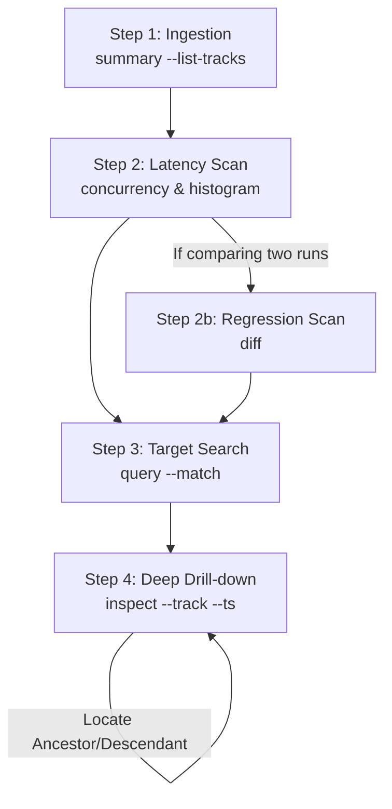

# Trace Analyzer Skill

This skill equips AI agents to systematically ingest, query, and diagnose Chrome Trace files (and Bazel execution profiles) using the native, high-performance `ztracing` CLI tool, assuming the `ztracing` binary is already available in the system execution path.

---

## 1. The Tool Suite Reference

The CLI utility provides subcommands that output formatted text tables.

### A. `summary <trace_file> [--list-tracks]`
Exposes high-level metadata of the trace (total events, concurrent tracks, and physical duration bounds) in Table format.
If `--list-tracks` is provided, it also lists all organized tracks showing their names, types (THREAD/COUNTER), event counts, and maximum stack depths in a second table.
*   **Use Case**: Initial trace ingestion. Use this to assess the total scale of the profile and map out the thread lanes.

### B. `inspect <trace_file> --track <name> --ts <ts_us>`
Performs a state-free coordinate lookup of a specific event, returning its inclusive duration, pre-calculated exclusive self-time, depth, parent, children, and custom arguments in Table format.
*   **Use Case**: Deep bottleneck analysis. Call this to inspect a specific event's parameters and call-tree context.

### C. `concurrency <trace_file> [--buckets <n>]`
Computes active thread concurrency over `n` time buckets (default is 16). Outputs a table showing the time range, average concurrency, a visual ASCII bar chart, and the dominant events in each bucket.
*   **Use Case**: Concurrency and latency visualization. Use this to find active compiler threads and locate active execution buckets.

### D. `aggregate <trace_file> [--group-by <name|category>] [--sort <duration|count>] [--min-count <n>]`
Groups events by name or category and calculates total duration, count, and average duration. Outputs a sorted table. Events with count < `min-count` (default is 2, which filters out single-instance events) are skipped, and a footnote is printed indicating how many were skipped.
*   **Use Case**: Identifying hot spots. Use this to find which types of events consume the most total time, filtering out noise from one-off events. You can set `--min-count 1` to see all events.

### E. `diff <baseline_file> <target_file> [--group-by <name|category>] [--sort <dur-delta|count-delta>]`
Compares two traces side-by-side, aligning events by their actual string values (name or category). Outputs a table showing baseline duration, target duration, duration delta, and count delta.
*   **Use Case**: Regression analysis. Use this to compare a slow build against a known fast baseline to isolate what regressed.

### F. `query <trace_file> [filters]`
Performs a chronological search and viewport extraction, outputting a table of matched events.
*   **Filters**:
    *   `--track <name>`: Scans only the target track.
    *   `--match <substr>`: Substring match on name/category (case-insensitive).
    *   `--t-start <us>` / `--t-end <us>`: Time-window interval overlap filtering.
    *   `--max-depth <n>`: Excludes events deeper than stack depth `n`.
    *   `--limit <n>`: Caps the result count.
*   **Use Case**: Locating specific actions or extracting a timeline slice.

### G. `histogram <trace_file> [filters]`
Computes linear or logarithmic duration distribution buckets and frequency counts for the matched events. Outputs a table with a visual ASCII distribution bar chart.
*   **Use Case**: S-curve and tail-latency diagnostics. Use this to characterize work distribution and locate slow outlier events.

---

## 2. Systematic Diagnostic Workflow (The 4-Step Loop)

To troubleshoot build or runtime latency, execute the following workflow:



### Step 1: High-Level Ingestion
Run `summary` with `--list-tracks` to understand the scale and map out the thread lanes:
```bash
ztracing summary <trace_file> --list-tracks
```

### Step 2: Latency Scan (Isolating the Tail)
Characterize the entire trace's event durations using a global histogram:
```bash
ztracing histogram <trace_file>
```
*   *Diagnostic*: Look at the tail buckets (durations in seconds or minutes). If there is a high count in the slow buckets, a latency bottleneck exists.

Run `concurrency` to locate active lanes and buckets:
```bash
ztracing concurrency <trace_file>
```
*   *Diagnostic*: Scan the active buckets to see which threads are executing long-running events (e.g., `TypeScriptCompile` or `SoyCompile`) during the slow slices.

### Step 2b: Regression Scan (Comparison)
If you have a baseline run, compare them directly to see what changed:
```bash
ztracing diff baseline.json target.json --sort dur-delta
```
*   *Diagnostic*: Look at the top entries with positive `Delta Dur`. These are the events that regressed the most.

### Step 3: Target Search
Use `query` with substring matching and time-windowing to locate the exact timestamps of the bottleneck actions:
```bash
ztracing query <trace_file> --match "TypeScriptCompile"
```
*   *Diagnostic*: Note down the `Track` and `Start Time (us)` of the slowest events returned by the query table.

### Step 4: Deep Drill-Down
Run `inspect` on the isolated coordinate `(track, ts_us)` to retrieve the complete metadata and call-tree context in Table format:
```bash
ztracing inspect <trace_file> --track "<track_name>" --ts <ts_us>
```
*   *Diagnostic*:
    *   Compare `dur_us` (inclusive) vs `self_time_us` (exclusive). If self-time is small, the bottleneck is in the nested `children` call-tree.
    *   Inspect `args` to retrieve custom parameters (e.g., compile inputs, file sizes, or target labels) to identify the exact package causing the slow build.
    *   Traverse `parent` or `children` coordinates to trace the call hierarchy if necessary.
