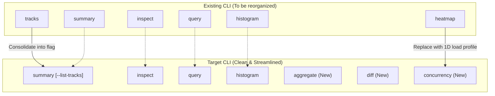

# `ztracing` CLI Improvement Plan

This document outlines a high-level design plan to reorganize and extend the **`ztracing` CLI** tool. 

The goal of this plan is to improve terminal ergonomics for performance engineers, reduce terminal output congestion, and introduce native trace-comparison capabilities—while keeping the tool strictly **general-purpose** and agnostic to any specific build system or trace generator.

---

## 1. Architecture & Command Mapping

The diagram below shows how the existing CLI commands will be streamlined and extended into the target CLI structure.



---

## 2. Detailed Command Specifications

### A. New Commands (Aggregation & Comparison)

> [!TIP]
> These commands solve the problem of having to write custom external scripts (like Python parsers) to summarize and compare large trace profiles.

#### 1. `ztracing aggregate <trace_file>`
*   **Purpose**: Sums up durations and counts of events globally to identify the main time-sinks in the trace.
*   **Syntax**:
    ```bash
    ztracing aggregate <trace_file> [--group-by=name|category] [--sort=duration|count]
    ```
*   **Default Behavior**: Groups by event `name` and sorts by total `duration` descending.
*   **Output Format**: A clean, sorted terminal table:
    ```
    Event Name      | Total Duration (s) | Event Count | Average Duration (ms)
    -------------------------------------------------------------------------
    StageRunfiles   | 470.21             | 2           | 235105.0
    Kt2JavaCompile  | 185.40             | 14          | 13242.8
    ```

#### 2. `ztracing diff <trace_file_1> <trace_file_2>`
*   **Purpose**: Performs a side-by-side delta comparison between a baseline ("good") and a target ("bad") trace.
*   **Syntax**:
    ```bash
    ztracing diff <trace_file_1> <trace_file_2> [--group-by=name|category] [--sort=dur-delta|count-delta]
    ```
*   **Output Format**: A side-by-side comparison table showing deltas:
    ```
    Event Name    | Baseline Dur (s) | Target Dur (s) | Delta Dur (s) | Delta Count
    ------------------------------------------------------------------------------
    StageRunfiles | 122.80           | 469.60         | +346.80       | +1
    Local parse   | 373.00           | 12621.00       | +12248.00     | +26190
    ```

---

### B. Replaced Commands (Ergonomics & Noise Reduction)

> [!WARNING]
> The existing `heatmap` command produces a 2D track-by-track grid. In highly concurrent traces (e.g., 1,500+ threads), this outputs up to 24,000 JSON cells, causing terminal truncation and context window bloat.

#### 1. `ztracing concurrency <trace_file>` *(Replaces `heatmap`)*
*   **Purpose**: Visualizes system load, concurrency, and serialization bottlenecks over time in a highly condensed format.
*   **Syntax**:
    ```bash
    ztracing concurrency <trace_file> [--buckets=N]
    ```
*   **Default Behavior**: Slices the timeline into 16 equal intervals (buckets).
*   **Output Format**: A compact 1D timeline showing active thread load and the dominant events:
    ```
    Bucket | Time Range (s) | Concurrency (Active Threads) | Dominant Events
    -------------------------------------------------------------------------------------
    [00]   | 0.0 - 15.6     | [████████████░░░░░░] 60%     | Javac, Kt2JavaCompile
    ...
    [15]   | 234.4 - 250.0  | [█░░░░░░░░░░░░░░░░░░] 5%      | StageRunfiles (100% of slice)
    ```
    *(This reduces the output from 24,000 lines down to 16 highly informative lines).*

---

### C. Consolidated Commands (CLI Clean-up)

#### 1. `ztracing summary <trace_file>` *(Consolidates `tracks`)*
*   **Modification**: The standalone `tracks` command (which just lists all tracks) is removed to clean up the top-level CLI.
*   **Syntax**:
    ```bash
    ztracing summary <trace_file> [--list-tracks]
    ```
*   **Behavior**:
    *   By default, outputs a lightweight global metadata block.
    *   With the `--list-tracks` flag, it appends the full list of track names, types, and event counts (the old `tracks` output).

---

### D. Unchanged Core Commands (Deep Drill-Down)

These core diagnostic commands remain unchanged to preserve coordinate-based lookups and tail-latency analysis:

*   **`ztracing query <trace_file>`**: Chronological search and viewport filtering (by track, match, ts-range, depth).
*   **`ztracing inspect <trace_file> --track <name> --ts <ts>`**: Coordinates-based drill-down showing metadata, arguments, self-time, and parent-child hierarchy for a single event.
*   **`ztracing histogram <trace_file>`**: Computes duration distribution buckets (linear or logarithmic) and frequency counts to analyze tail-latency.
